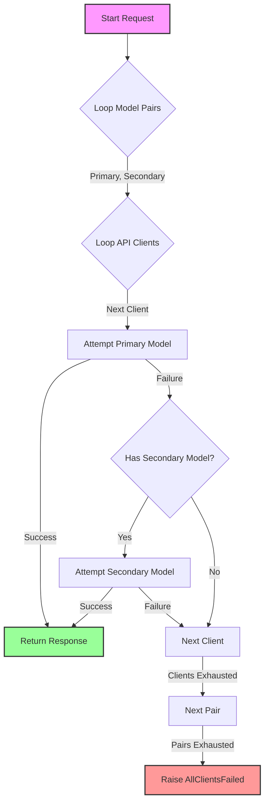

# Gemini Rotate


A lightweight Python library for Google Gemini API key rotation, valid model selection, and automatic fallback to "Lite" models on server errors. Supports both **Async** and **Sync** execution.

## 🚀 Features

- **✅ Automatic Key Rotation**: Seamlessly rotates through a list of API keys when quota is exhausted (`429`), permission denied (`403`), or any other API error occurs.
- **🔄 Smart Model Fallback**: Automatically downgrades specific models (e.g., `gemini-2.0-flash` -> `gemini-2.0-flash-lite`) if server errors (`5xx`) persist.
- **⚡ Async & Sync Support**: Built on top of the `google-genai` client, offering both `async` (`generate_content`) and `sync` (`generate_content_sync`) methods for high-performance and standard applications.
- **🛡️ Robust Error Handling**: Implements exponential backoff before rotating keys or switching models.
- **📝 Concise Logging**: Logs only essential success/failure information (e.g., `400 INVALID_ARGUMENT`) to keep your console clean.

## 📦 Installation
```bash
pip install gemini-rotate
```

## ⚡ Quick Start

1.  **Configure Environment**: Create a `.env` file.
    ```env
    GEMINI_API_KEY_1="AIzaSy..."
    GEMINI_API_KEY_2="AI3yhj..."
    GEMINI_API_KEY_3="AIdf56..."
    ```

2.  **Run Code**:
    ```python
    import asyncio
    from gemini_rotate import GeminiRotationClient
    
    async def main():
        client = GeminiRotationClient()
        response = await client.generate_content("Hello, Gemini!")
        print(response.text)
    
    asyncio.run(main())
    ```

## 📖 Usage Guide

### Initialization
The client automatically loads API keys from your environment variables (`GEMINI_API_KEY_1`, `GEMINI_API_KEY_2`, etc.).

```python
client = GeminiRotationClient()
```

### Generating Content
The library provides both asynchronous (`generate_content`) and synchronous (`generate_content_sync`) methods. Both methods wrap the standard `google-genai` calls but add rotation and fallback logic.

#### 1. Async Text Generation
```python
import asyncio
from gemini_rotate import GeminiRotationClient
from dotenv import load_dotenv

load_dotenv()

async def generate_text():
    client = GeminiRotationClient()
    try:
        response = await client.generate_content(
            contents="Explain quantum computing in 50 words."
        )
        print(f"Generated text: {response.text}")
    except Exception as e:
        print(f"Error: {e}")

if __name__ == "__main__":
    asyncio.run(generate_text())
```

#### 2. Sync Text Generation
```python
from gemini_rotate import GeminiRotationClient
from dotenv import load_dotenv

load_dotenv()

def generate_text_sync():
    client = GeminiRotationClient()
    try:
        response = client.generate_content_sync(
            contents="Explain quantum computing in 50 words."
        )
        print(f"Generated text: {response.text}")
    except Exception as e:
        print(f"Error: {e}")

if __name__ == "__main__":
    generate_text_sync()
```

#### 3. Advanced: Tool Calling & Structured Output (Async Example)
You can pass `tools` and `response_schema` (or `response_mime_type`) via the `config` parameter.

```python
import asyncio
from google import genai
from gemini_rotate import GeminiRotationClient
from pydantic import BaseModel
from dotenv import load_dotenv

load_dotenv()

# Define a schema for structured output
class Recipe(BaseModel):
    title: str
    ingredients: list[str]
    instructions: list[str]

async def generate_recipe():
    client = GeminiRotationClient()

    try:
        response = await client.generate_content(
            contents="Give me a recipe for chocolate cake.",
            config={
                "response_mime_type": "application/json",
                "response_schema": Recipe,
            }
        )
        
        # Parse result directly into Pydantic model
        recipe = response.parsed
        print(f"Title: {recipe.title}")
        print(f"Ingredients: {recipe.ingredients}")
        
    except Exception as e:
        print(f"Error: {e}")

if __name__ == "__main__":
    asyncio.run(generate_recipe())
```

#### Parameters
| Parameter | Type | Description |
| :--- | :--- | :--- |
| `contents` | `str` \| `list` | The prompt or content to send. |
| `model` | `str` | (Optional) The specific model to use. Defaults to first in priority list. |
| `config` | `dict` | (Optional) Generation config (temperature, tools, schema) passed to `google.genai`. |

## ⚙️ Configuration

### 1. The `.env` Format (Expected)
To configure the library, create a `.env` file in the root of your project. The library expects the following format:

```env
# Required: Define your Gemini API keys using the pattern GEMINI_API_KEY_<number>
GEMINI_API_KEY_1="AIzaSy..."
GEMINI_API_KEY_2="AI3yhj..."
GEMINI_API_KEY_3="AIdf56..."

# Optional: Define your models in a valid JSON array format.
# The models will be processed in pairs (Primary -> Secondary fallback).
GEMINI_MODELS='["gemini-2.5-flash", "gemini-2.5-flash-lite", "gemini-2.0-flash"]'
```

*(Note: A single `GEMINI_API_KEY` environment variable is also supported as a fallback, but using the numbered pattern `GEMINI_API_KEY_n` allows for rotation.)*

### 2. Model Priority Breakdown
You can customize the order in which models are attempted by setting `GEMINI_MODELS` in `.env` as shown above. The string MUST be a valid JSON array. The library processes models in **Primary -> Secondary** pairs.

**Default Behavior (if GEMINI_MODELS is not set):**
1.  `gemini-flash-latest` -> `gemini-flash-lite-latest`
2.  `gemini-3-flash-preview` -> `gemini-2.5-flash`
3.  `gemini-2.5-flash-lite` -> `gemini-2.0-flash`
4.  `gemini-2.0-flash-lite` -> (None)

**Custom Configuration:**
```env
GEMINI_MODELS='["gemini-2.5-flash", "gemini-2.5-flash-lite", "gemini-2.0-flash"]'
```

## 🔍 How it Works



## 🤝 Contributing

Contributions are welcome! Please feel free to submit a Pull Request.
